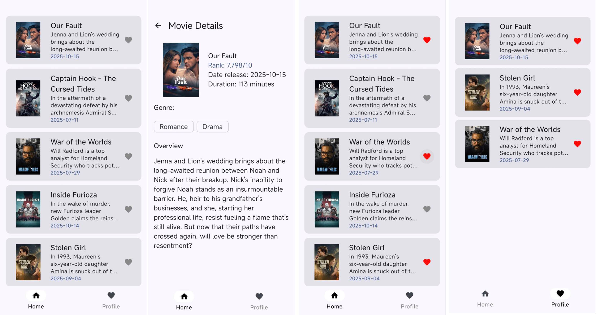

MovieDB App

MovieDB App is a mobile Android application for browsing popular movies from The Movie Database (TMDB). The app allows you to:

View a list of popular movies with posters, descriptions, and release dates.
Navigate to movie details (rating, genres, runtime, overview).
Add/remove movies to favorites with local storage (offline access).
Navigation via Bottom Navigation Bar (Home, Favorites).

Screenshots.

  